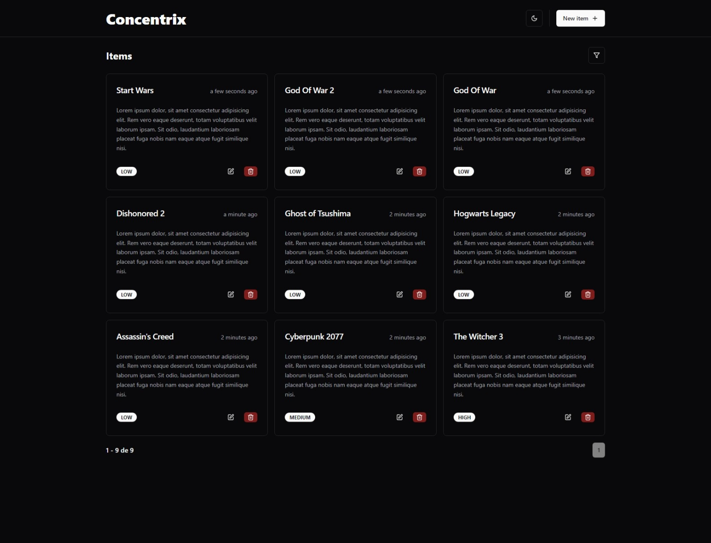

# Concentrix Challenge

## Português

#### Aplicação de Gerenciamento de Itens em React com CRUD, Temas e Funcionalidades Avançadas

Este projeto é uma aplicação desenvolvida em React que permite gerenciar uma lista de itens diretamente no front-end, sem a necessidade de back-end. A aplicação oferece as operações completas de CRUD (Create, Read, Update, Delete), além da alternância entre temas Dark e Light.

## English

#### Item Management Application in React with CRUD, Themes, and Advanced Features

This project is a React-based application that allows for managing a list of items entirely on the front-end, without the need for a back-end. The application supports full CRUD operations (Create, Read, Update, Delete) and includes the ability to switch between Dark and Light themes.

## Screenshots

    

        
        
        
        
        
    

